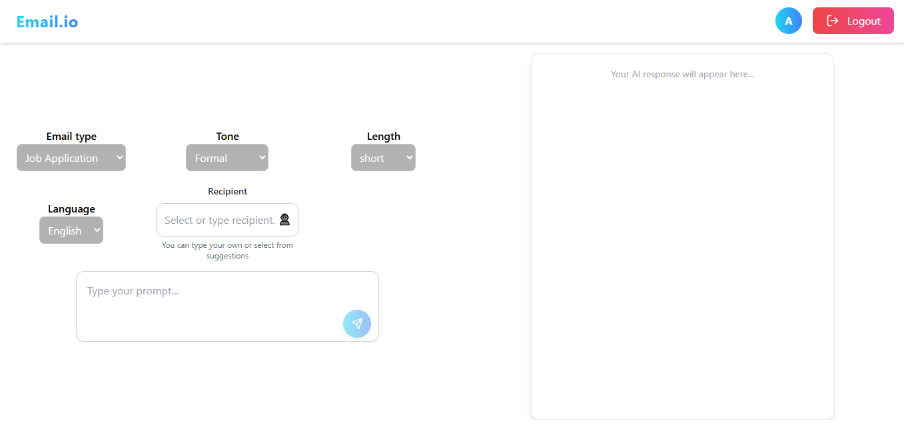

#  AI Email Generator (Frontend)

An AI-powered email generator web application that helps users create professional, well-structured emails instantly based on their input.

---

## ✨ Features

*  Generate professional emails using AI
*  Secure User Authentication (Login / Signup)
*  Multiple email types (Job, Leave, Formal, etc.)
*  Multi-language support
*  Fast and responsive UI
*  Clean and modern design

---

## 🛠️ Tech Stack

*  React.js
*  Tailwind CSS
*  Axios
*  REST API Integration

---

## 📂 Folder Structure

```
src/
│── components/
│── features/
│── context/
│── services/
│── App.jsx
│── main.jsx
```

---

## ⚙️ Getting Started

### 1️⃣ Clone the repository

```bash
git clone https://github.com/akramansari27923mah-dotcom/ai-email-generater-.git
```

### 2️⃣ Navigate to project folder

```bash
cd ai-email-generater-/Frontend
```

### 3️⃣ Install dependencies

```bash
npm install
```

### 4️⃣ Run the project

```bash
npm run dev
```

---

## 🔑 Environment Variables

Create a `.env` file in the root directory and add:

```env
VITE_API_URL=your_backend_api_url
```

---

## 🔗 Backend Repository

* https://github.com/akramansari27923mah-dotcom/ai-email-auth-api.git

---

## 📸 Screenshots

###  Home Page


### 🔐 Login Page

---

## 🌐 Live Demo

* https://ai-email-generater.vercel.app/login *

---

## 🙌 Author

**Akram Ansari**

*  Frontend Developer
*  MERN Stack Developer

---

## 📬 Contact

* GitHub: https://github.com/akramansari27923mah-dotcom
* Email: [akramansari27923mah@gmail.com ](mailto:akramansari27923mah@gmail.com )

---

## ⭐ Support

If you like this project, give it a ⭐ on GitHub!
